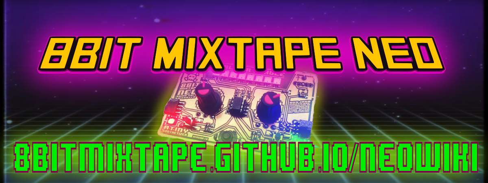
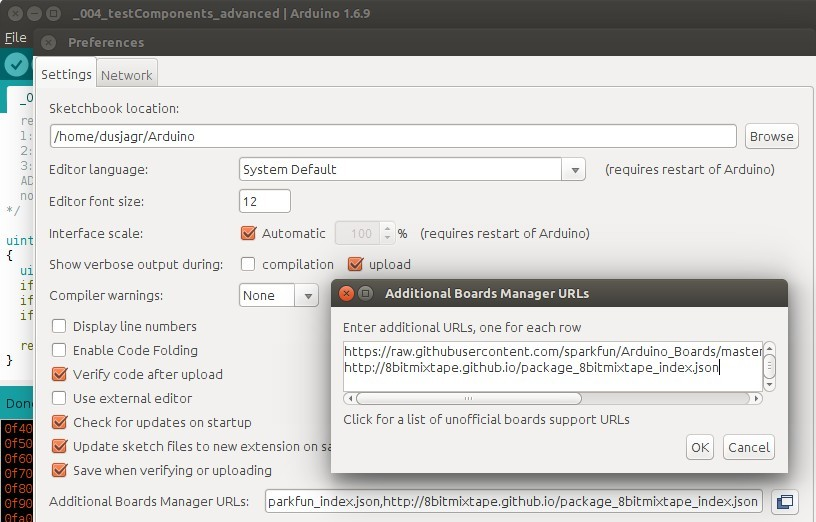

The 8Bit Mixtape is a lo-fi 8Bit synthesizer based on the Arduino-compatible ATTINY85, featuring 2 Pots, 2 Buttons and 8 adressable RGB Neo-pixels. The key feature of the new 8Bit Mixtape is the easiness of uploading new codes using an audio communication protocol, means just playing a .wav sound file from your computer/smart phone (or walkman). A specific bootloader (TinyAudioBoot) has to be installed on the chip to be able to do so.

# Overview

## Uploading new codes

The key feature of the new 8Bit Mixtape is the easiness of uploading new codes using an audio communication protocol, means just playing a .wav sound file from your computer/smart phone \(or walkman\).  
A specific bootloader \([TinyAudioBoot](https://github.com/ChrisMicro/TinyAudioBoot)\) has to be installed on the chip to be able to do so. The bootloader is the first program that is started when you turn on your mixtape. you should see the right led blinking slowly. The bootloader is in waiting programmable mode for 5 seconds, and then starts the main program. If your board, doesnt blink for 5 seconds, maybe the bootloader has disappeared, see below for instructions on how to flash the bootloader \(using ISP-programming\).

### Reset, play .wav -&gt; re-program your Mixtape

very very simple!

### Try it now! click play button below

[https://github.com/8BitMixtape/8Bit-Mixtape-NEO/raw/master/Code/NEO\_8Pixel-OneLiners/NEO\_8Pixel-OneLiners.ino.wav](https://github.com/8BitMixtape/8Bit-Mixtape-NEO/raw/master/Code/NEO_8Pixel-OneLiners/NEO_8Pixel-OneLiners.ino.wav)

## Using the Arduino IDE and program yourself

### Adding the Board to the Arduino IDE

Add this line to your "**Additional Board Manager URLs**" in the Preferences \(click on the little square on the right to open an editable list\):

[http://8bitmixtape.github.io/package\_8bitmixtape\_index.json](http://8bitmixtape.github.io/package_8bitmixtape_index.json)

### Examples codes

Download this whole repository and find the path to the example codes: [https://github.com/8BitMixtape/8Bit-Mixtape-NEO/tree/master/Code](https://github.com/8BitMixtape/8Bit-Mixtape-NEO/tree/master/Code)

### Libraries Included

* ** **[**8Bit Mixtape Library**](https://github.com/8BitMixtape/_8Bit-Mixtape-NEO-Lib)** ** \(under development, included since v0.0.13\)
* **Adafruit library **
* WS\_2812 Light
* [See the full list](https://github.com/8BitMixtape/8BitMixtapePlatform/tree/master/avr/libraries) 

### Burning the Bootloader

In case you use a fresh/new attiny, you need to upload the bootloader first, before being able to use it with the Audio-Programming.

Install the 8Bit Mixtape as described above. You can then choose "Burn bootloader" form the menu.

Connect an ATTINY85 to your ISP-Programmer. Arduino as ISP works also fine. 
(See maaaany instructions on the web for doings so. [example here](https://create.arduino.cc/projecthub/arjun/programming-attiny85-with-arduino-uno-afb829))

#### From Arduino IDE

Tools &gt; Burn Bootloader

#### From Terminal

1. **Burn fuses:**

   `avrdude -P /dev/ttyACM0 -b 19200 -c avrisp -p t85 -U efuse:w:0xfe:m -U hfuse:w:0xdd:m -U lfuse:w:0xe1:m`

   `sudo avrdude -P usb -b 19200 -c avrispmkii -p t85 -U efuse:w:0xfe:m -U hfuse:w:0xdd:m -U lfuse:w:0xe1:m`

2. **Flash Bootloader:**

   `avrdude -v -pattiny85 -c avrisp -P/dev/ttyACM0 -b19200 -Uflash:w:/home/dusjagr/.arduino15/packages/8BitMixtape/hardware/avr/0.0.9/bootloaders/tinyaudioboot/AudioBootAttiny85_AudioPB3_LEDPB1.hex:i`

   `avrdude -v -pattiny85 -c avrispmkii -P usb -b19200 -Uflash:w:/home/dusjagr/.arduino15/packages/8BitMixtape/hardware/avr/0.0.15/bootloaders/tinyaudioboot/AudioBootAttiny85_AudioPB3_LEDPB1.hex:i`

