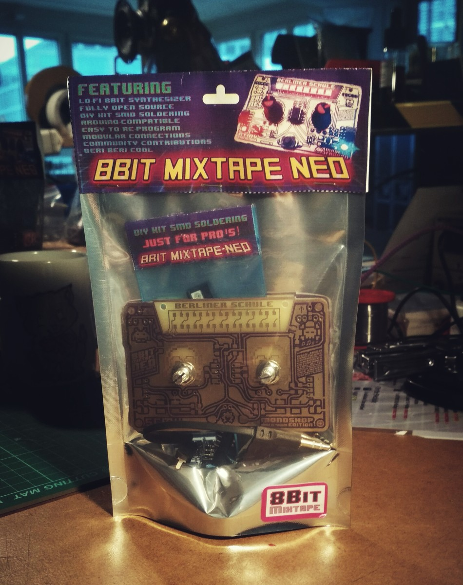
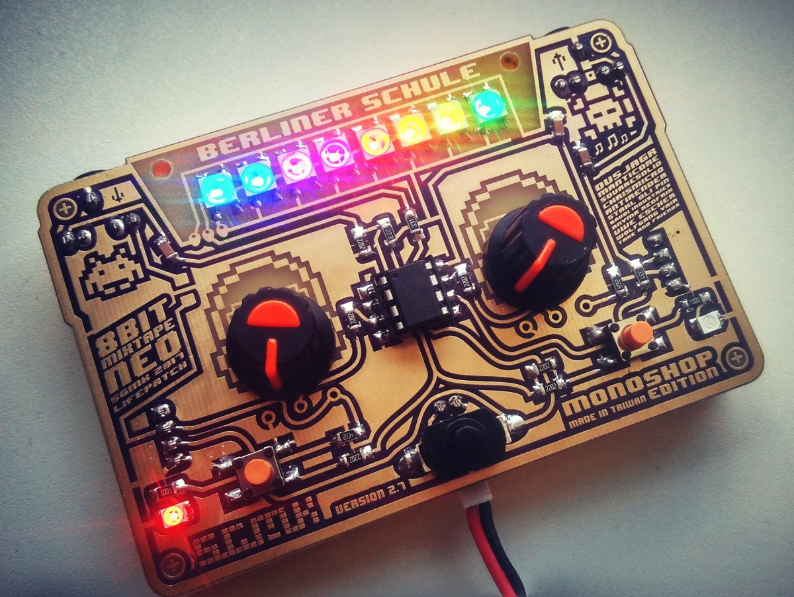

# [We are selling!!!](mailto:shop@8bitmixtape.cc)

### Series 1 | Batch 001/002 - Lab by Dimension Plus | Taiwan Special Edition

###Series 1 | Batch 003 - Berliner Schule | Monoshop Special Edition

# Series I - DIY Kits for 8Bit Mixtape NEO

## "Just for Pro's" SMD Kit (65 € ~~instead of 85€~~)

## "Easy Kit" SMD-preassembled (85 € ~~instead of 99€~~)

## "Deluxe Add-Ons" (on demand)
* Gold Chain
* 3d-printed case
* Internal Speaker
* LiPo battery and charging unit
* bling bling

## on demand - Hipster versions ([contact shop](mailto:shop@8bitmixtape.cc))

# Series II - coming soon... (est Jan 2018)

* Minor improvements for battery positioning
* new design elements
* factory pre-assembled version of "Easy Kit"

# Where to buy it

## In Your Local Shop

### Berlin

**Common Ground - Since 2017**

https://commonground.community/

**Central Music - Since 1986**

http://centralmusicberlin.blogspot.de/

### Hong Kong

**Lab by DimensionPlus HK**

http://labbydimensionplus.co/hk/

### Shenzhen

### Taipei

### Tel Aviv

### Yogyakarta

### Zürich

**UP BEAT - Musikhaus**

http://www.upbeat.ch

**Dymax.iøn**

https://www.dymax.io/

## Online Re-sellers

get in contact with us! [mailto:shop@8bitmixtape.cc](mailto:shop@8bitmixtape.cc)

