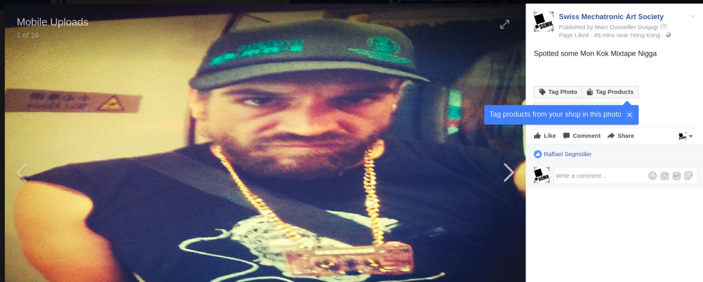
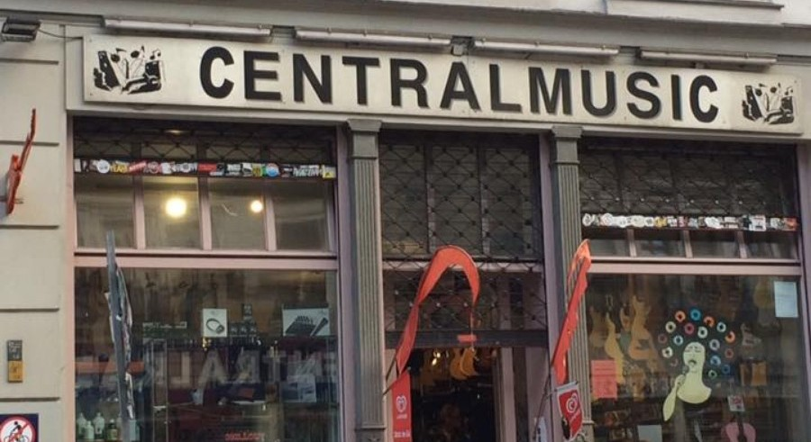

# [We are selling!!!](mailto:shop@8bitmixtape.cc)

Send a mail to [shop@8bitmixtape.cc](mailto:shop@8bitmixtape.cc)

clarify your order:
* (....) "Just for Pro's" DIY SMD soldering Kit - 65 € ~~75€~~
* (....) "Easy Kit" (SMD-presoldered) - 85 € ~~95€~~
* (....) Deluxe add-ons (Goldchetteli, LiPo Batterie and other goodies) - € on demand
* (....) payment cash, invoice, banktransfer or [PayPal](https://www.paypal.me/8bitmixtape)
* (....) Personal meeting, Pick-Up, Bring-In, per Post (send adress)

**Free Shipping Worldwide!!!**

### Series I | Batch 001/002 - Lab by Dimension Plus | Taiwan Special Edition

###Series I | Batch 003 - Berliner Schule | Monoshop Special Edition

# Series I - DIY Kits for 8Bit Mixtape NEO

## "Just for Pro's" SMD Kit (65 € ~~instead of 75€~~)

## "Easy Kit" SMD-preassembled (85 € ~~instead of 95€~~)

## "Deluxe Add-Ons" (on demand)
* Gold Chain
* 3d-printed case
* Internal Speaker
* LiPo battery and charging unit
* bling bling

## on demand - Hipster versions ([contact shop](mailto:shop@8bitmixtape.cc))

# Series II - coming soon... (est Jan 2018)

* Minor improvements for battery positioning
* new design elements
* factory pre-assembled version of "Easy Kit"

# Special Vintage Series - 8Bit Mixtape 1.0 RETRO (limited)

A re-birth of the classic 2014 Manila Edition, now compatible to AudioProg and NEO!!

# Where to buy it

## In Your Local Shop

### Berlin

**Central Music - Since 1986**

http://centralmusicberlin.blogspot.de/
to be delivered soon...

**Common Ground - Since 2017**

https://commonground.community/

### Hong Kong

**Lab by DimensionPlus HK**

http://labbydimensionplus.co/hk/

### Shenzhen

### Taipei

### Tel Aviv

### Yogyakarta

### Zürich

**UP BEAT - Musikhaus**

http://www.upbeat.ch

**Dymax.iøn**

https://www.dymax.io/

## Online Re-sellers

get in contact with us! [mailto:shop@8bitmixtape.cc](mailto:shop@8bitmixtape.cc)

