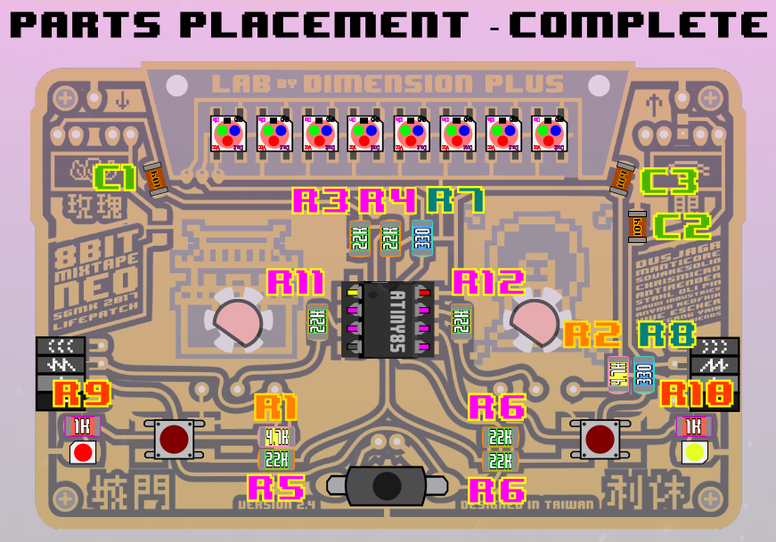
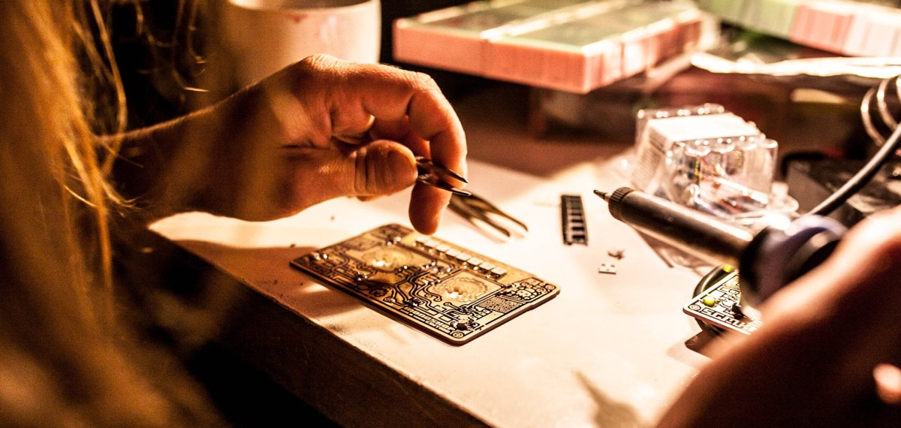
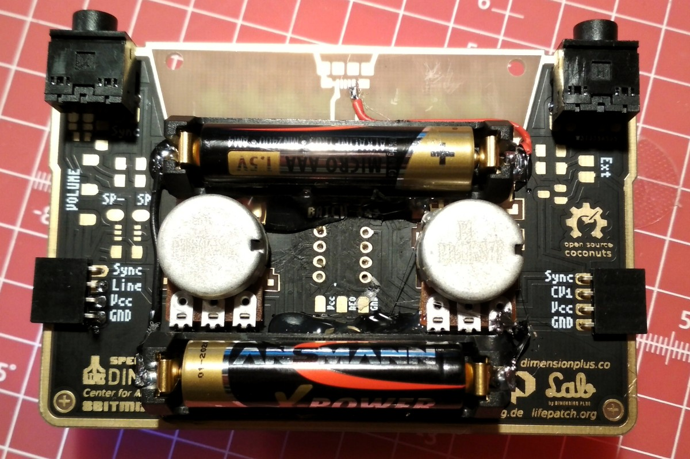
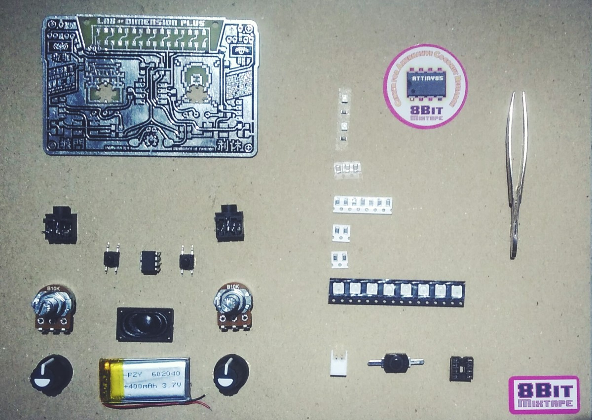

# Parts Placement

Download printable [8BitMixtapeNEO_PartsPlacement](https://github.com/8BitMixtape/8BitmixtapeNEO_ShenzhenReady/blob/master/8BitMixtapeNEO_PartsPlacement_V04.pdf)

# SMD parts
### Frontside

| Part            | Value    | SMD-Code   | Amount |
| ----------------|----------|------------|--------|
| R1, R2          | 4.7K     | 4701 (472  |   2    |
| R3-R6, R11, R12 | 22K      | 2202 (223  |   7    |
| R7, R8          | 330Ohm   | 3300 (331) |   2    |
| R9, R10         | 1K       | 1001 (102) |   2    |
| C1-C3           | 100nF    |            |   3    |
| LED1, LED2      | red/blue |            |   2    |
| NEO-Pixel       | SK6812   |            |   8    |

### Backside
| Part            | Value    | SMD-Code   | Amount |
| ----------------|----------|------------|--------|
| C4              | 10µF     |            |   1    |

## Tips for SMD soldering

**IT's EASY!!!**

### Tools and Materials needed

### Solder your frist Part

### Careful with the NEO-Pixels

### DONE!!

# Big Parts
### Frontside
| Part            | Value    |            | Amount |
| ----------------|----------|------------|--------|
| Buttons         |          |shorten legs|   2    |
| On/Off Switch   |          |bend/cut legs|   1    |
| IC-Socket       | DIL-8    |            |   1    |
| Attiny85        |          | plug it in |   1    |

### Backside
| Part            | Value    |            | Amount |
| ----------------|----------|------------|--------|
| Potentiometer   | 10K lin  |            |   2    |
| AudioJack       | 3.5m     |  Stereo    |   2    |
| Side-Connector  | 4 Pin    |  female    |   2    |
| (external power)| 2 Pin/USB|  optional  |   1    |
| (AAA Holder)    |          |  optional  |   2    |

## Tips for soldering
coming soon... 

# Power Management
## AAA Battery holders

### other options
#### External PowerPack

#### Using USB-wired power

#### Using LiPo Battery

# Deluxe Options

# Parts Overview

