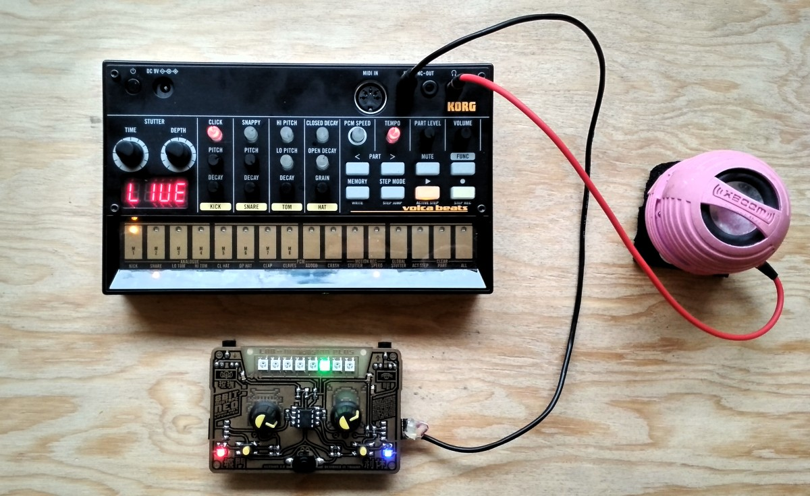

## Sync to KORG and Pocket Operators

Finally managed to test and connect to the KORG volca series and PO. Success!!!

Since the beginning of our hardware developement we have foreseen to ability to connect to other popular synthesizers, both with a CV output and input, aswell as synchronizing the speed/clock of connected devices with the "SYNC" out from the 8Bit Mixtape NEO.

https://raw.githubusercontent.com/8BitMixtape/Workshop_Examples/master/_062_8NeoPixelSequencer_syncOut-PO/_062_8NeoPixelSequencer_syncOut-PO.ino.wav

This code needs "Reset disabled" set via fusebits
   `avrdude -P /dev/ttyACM0 -b 19200 -c avrisp -p t85 -U efuse:w:0xfe:m -U hfuse:w:0x5d:m -U lfuse:w:0xe1:m`

## How to sync to KORG volca series

http://www.korg.com/us/products/dj/volca_beats/

## How to sync to pocket operator PO-series by Teenage Engineering

https://teenage.engineering/products/po