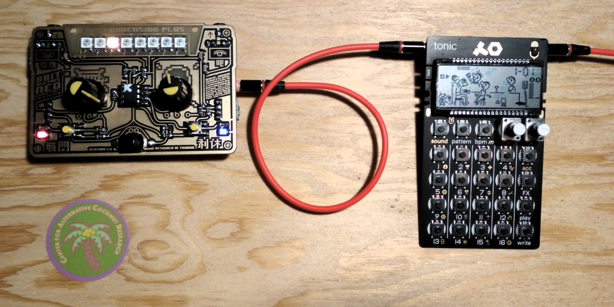

## Sync to KORG and Pocket Operators

Finally managed to test and connect to the KORG volca series and PO. Success!!!

Since the beginning of our hardware development we have foreseen to ability to connect to other popular synthesizers, both with a CV output and input, as well as synchronizing the speed/clock of connected devices with the "SYNC" out from the 8Bit Mixtape NEO.

https://raw.githubusercontent.com/8BitMixtape/Workshop_Examples/master/NEO_062_Sequencer_syncOut-PO/NEO_062_Sequencer_syncOut-PO.wav

https://github.com/8BitMixtape/Workshop_Examples/raw/master/NEO_062_Sequencer_syncOut-PO/NEO_062_Sequencer_syncOut-PO.ino.wav

https://github.com/8BitMixtape/Workshop_Examples/blob/master/NEO_062_Sequencer_syncOut-PO/NEO_062_Sequencer_syncOut-PO.ino.wav

https://raw.githubusercontent.com/8BitMixtape/8Bit-Mixtape-NEO/master/wavFiles/NEO-Sequencer-syncOut-PO.wav

This code needs "Reset disabled" set via fusebits
   `avrdude -P /dev/ttyACM0 -b 19200 -c avrisp -p t85 -U efuse:w:0xfe:m -U hfuse:w:0x5d:m -U lfuse:w:0xe1:m`

## How to sync to KORG volca series

http://www.korg.com/us/products/dj/volca_beats/

The KORG sync input is usually connected with a mono-jack cable, so the sync signal has to be on the tip of the mini-jack. The 8Bit Mixtape was designed to send sync on the Ring [T|R|S] of the jack. To connect the 8Bit Mixtape as "Master" to the KORG we advise to use the outputs on the side and make your own connector cable.

Another method is to solder the plug of the 8Bit Mixtape inverted from the top of the PCB, which will switch the polarity of the connection!

## How to sync-in from KORG volca series

(image soon)

Korg Volca sync-out pulses can be detected and counted with pin state change interrupts. This first test uses counter-intuitively the same sync-out pin(PB5) solder points on right side of the 8BitMixtape board as the sync-out example above. Ideally the sync-in solder points or the programming audio jack could be used, but the interrupt might interfere with reading the buttons on that pin(PB3). This needs to be explored next. Korg Volca sends four pulses per beat and the interrupt code counts these, and triggers play function (oneliner example) every four pulses, ie the beat. The pot tweaking interferes the sync since the playback speed changes, but sync can be easily found again. Crude example, but a start.

Code example here:
https://github.com/8BitMixtape/8Bit-Mixtape-NEO/tree/master/Code/NEO_SyncOut_OneLiner

Short video here:
https://www.youtube.com/watch?v=_05s-ouzIVY

## How to sync to pocket operator PO-series by Teenage Engineering

https://teenage.engineering/products/po