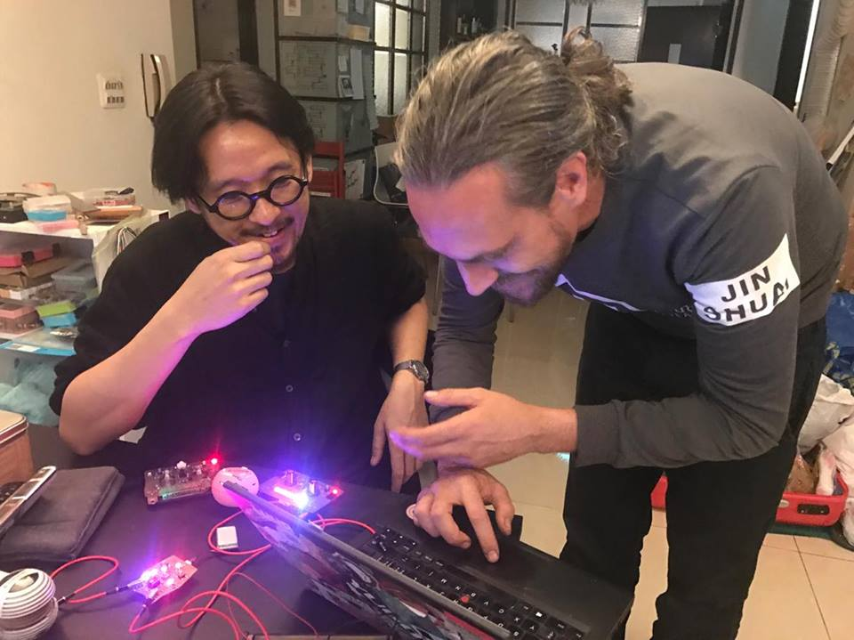

# Upcoming Workshops 

# Workshops 2017-18

## Pre-Proto Workshops, Taipei, Taiwan

15-20. March

was fun!

## Tokyo, Japan

1/2. April

## Dimension Plus LAB, Taipei, Taiwan

4th April. See fbook: [https://github.com/8BitMixtape/8Bit-Mixtape-NEO/wiki/1\_1-Workshops](https://github.com/8BitMixtape/8Bit-Mixtape-NEO/wiki/1_1-Workshops)

MixTape Clinic... still going on

## Yogyakarta, Indonesia

tba early April

## Singapore

~~tba mid april~~

## Make Munich, München, Germany

6/7. May

## Technical Museum & Radiona, Zagreb, Croatia

8/9. June 2017

More info [here](https://github.com/8BitMixtape/8Bit-Mixtape-NEO/wiki/1_2-NeoCoco-Workshop-Zagreb)

## Proto Workshops, Taipei, Taiwan

31 July 2017

## 8Bit Mixtape Workshops - Hong Kong @ Common Room & DimensionPlus Lab TW

6 August 2017

## 8Bit Mixtape Berliner Series

10 August 2017 @ Mono Shop

11 August 2017 @ Common Ground

## Zürich?

## Bern?

