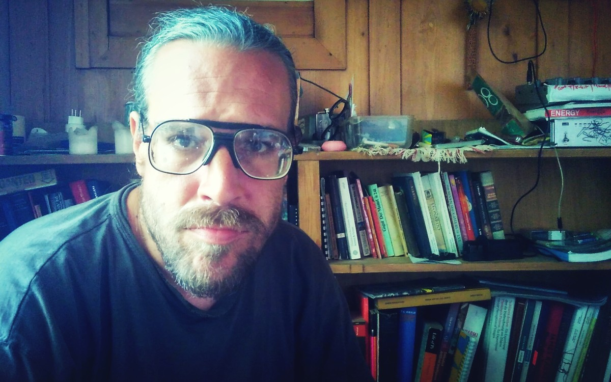
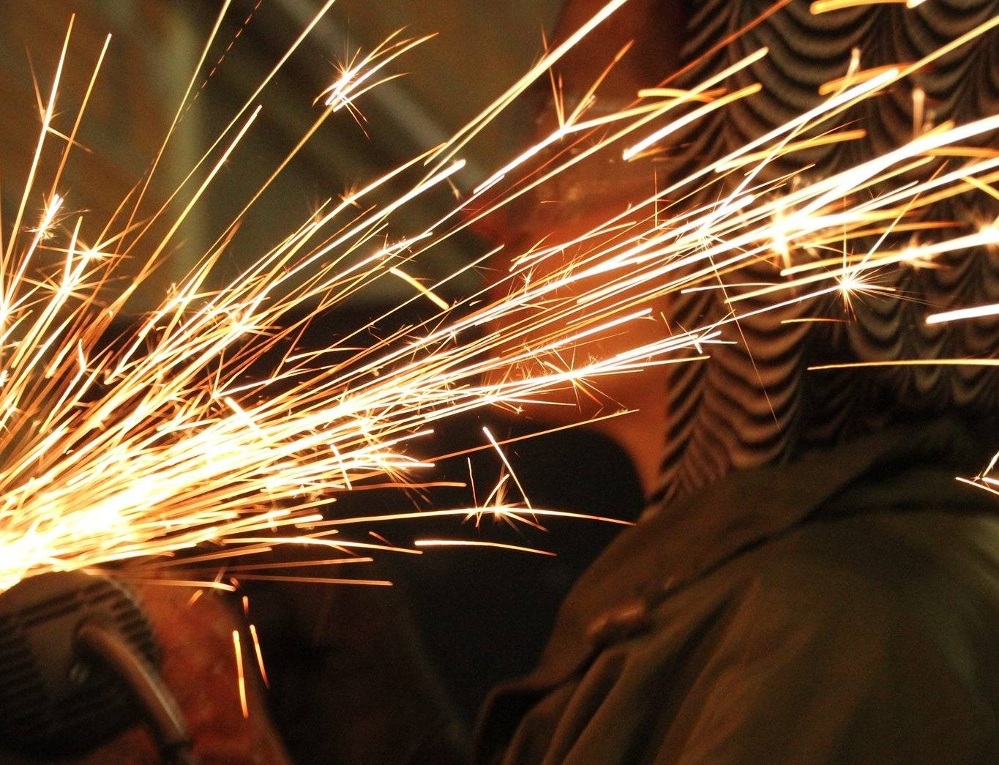

# Workshop Barcelona @ MUTAN MONKEY Analog Instruments

# Saturday 23. March 2019

## Description 

Finally another build and code Workshop for making the famous 8Bit Mixtape NEO is happening in Barcelona, Spain! Join us for a session of soldering and experimenting with lo-fi 8Bit soundzzz and bluuurrrps.

The 8Bit Mixtape NEO is a lo-fi 8Bit synthesizer based on the Arduino-compatible ATTINY85, featuring 2 Pots, 2 Buttons and 8 addressable RGB Neo-pixels. The key feature of the new 8Bit Mixtape NEO is the easiness of uploading new codes using an audio communication protocol.

The 8Bit Mixtape NEO has been developed since Winter 2017 by dusjagr, ChrisMicro (RoboterClub Freiburg), Budi Prakosa and many other contributors! Since 2018 it's ready for sale as a DIY-Kit on our [new website](http://neo.8bitmixtape.cc/), or in the shop of MUTAN MONKEY, and many new [examples from community contributors](http://neo.8bitmixtape.cc/mixtape) are available.

## Related Info on the 8Bit Mixtape

Check-out what other people wrote about it:
http://wiki.8bitmixtape.cc/#/4_13-Publication

# Mentors

## Marc Dusseiller aka dusjagr

See more on http://me.dusjagr.guru

Marc Dusseiller aka dusjagr is a nomadic researcher and workshopologist. He is part of the [Center for Alternative Coconut Research](http://www.randelab.ch/) and co-founder of [SGMK](http://mechatronicart.ch) and the [Hackteria network](http://hackteria.org). Before travelling the world for making DIY / DIWO laboratories for creative biological experimentation with living media, Marc entered the world of DIY electronics, designing printed circuit boards for synthesizers and organizing workshops and festivals mostly in Zürich, Taipei and Yogyakarta. He also loves [coconuts](http://neo.8bitmixtape.cc/).

## Paula Pin

Pin is a transhackfeminist performer and researcher which has a strong inclination towards research and experimentation processes with collective and free technologies.

Her working fields range from drawing to abstract video or circuit bending, but always located in the intersection where biology, science and queer art collide.

Interactive kinetic sculptures, immersible environments, audiovisual installations, performance and direct action are the art disciplines that she has used in her search for developing new channels to communicate desires and sensations, using the physical body as the bridge which connects nature and technology.

https://jellypin.hotglue.me/
