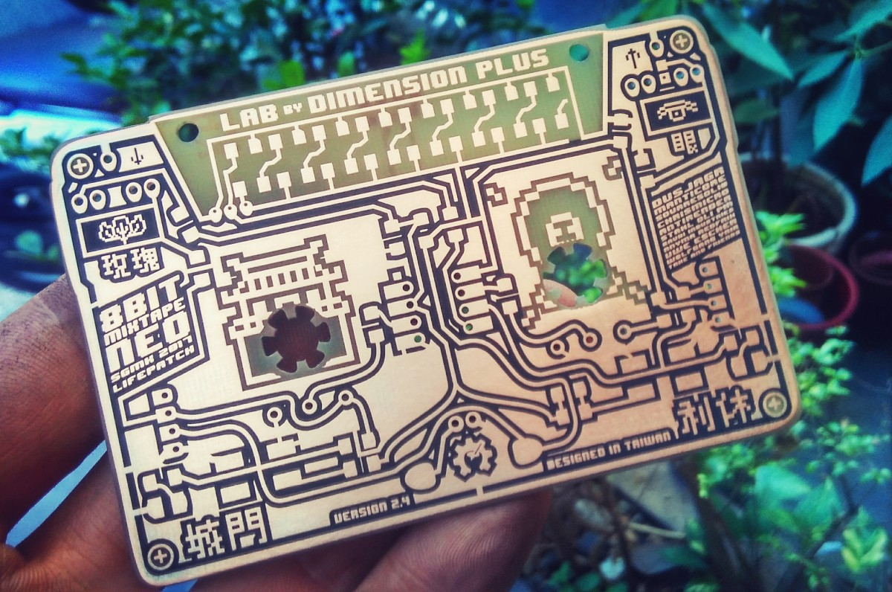

# 8位元混音帶合成器

# 8Bit Mixtape NEO @ TAxT Festival, October 2017

## Date and Location

15th October 2017, 13 - 17h

[2017 Taoyuan Art X Technology Festival](https://taxt.tw/portfolio/8bit-mixtape-neo/)

## Texts

_"8bit Mixtape History and Showcase"_
8位元混音帶合成器是一個自製的聲音與節奏電子樂器。源自ANYMA的”BABY-GNUSBUINO”與Viznut (Ville-Matias Heikkilä)的”一行程式碼的演算交響樂(Algorithmic symphonie from one line of code)實驗”，馬克與Budi Prakosa、Chrismicro等朋友們整合眾人的智慧完成”8位元混音帶”(8 bit MixTape) 的開放硬體電子合成器，後續又發展創造出各種有趣的版本。 8位元混音帶合成器除了對舊媒體錄音帶的懷想呼應外，以開放硬體分享所有製作流程與資料，希望更多對自製合成器有興趣以及開放硬體製作分享的人們共同參與。

The 8bit Mix Tape is a homemade electronic instrument for making sound and rhythms. It is based on ANYMA’s”BABY-GNUSBUINO” and Viznut’s (Ville-Matias Heikkilä) experiment on algorithmic symphonie from one line of code, put together by Marc Dusseiller and friends Budi Prakosa and Chrismicro. The 8bit Mix Tape is an arduino compatible sound synthenizer that paves the way for many exciting versions later on. In addition to a throwback to being a traditional cassettes, but 9bit Mix Tape is also an effort to provide compatible hardware for sharing production details and information, encouraging participation by anyone interested in making DIY synthesizer and compatible gadget

_"8bit Mixtape Neo Workshop"_
工作坊中馬克將帶領大家自己製作完成”最新台灣限定版本”的8位元混音帶(8 bit MixTape Neo)電子合成器。喜歡自己動手做的朋友們將自己組焊單晶片與簡單聲音上傳，創造出自己喜愛的演算聲響、噪音與復古的80年代遊戲機音樂風格的8位元混音帶合成器，這場工作不用自己帶工具，我們將為參加者準備材料與工具。

Marc Dusseiller will conduct a workshop on “How to Make Yourself an 8-bit Mix Tape Neo (Taiwan Only)”. All you DIY fans are invited to upload your own handmade/welded chips and sound online. You can create your own favourite digital tune, noise, or a throwback to the 80s video game songs on a 8-bit Mix Tape Neo. Simply show up at the venue and we’ll have all the materials and tools ready for you.

"introduction of Marc"

## Photos for 8Bit Mixtape NEO

## General Photos of History of the 8Bit Mixtapes

During the Festival Exhibition a setup is displayed for the audience to explore and play with various editions of the mixtape. The table resemles the development process from early prototypes, DIY etched boards and Rako boxes for travelling the world to work with all the mixtape partners in Indonesia, Taiwan and Switzerland.

**DO NOT TOUCH THE ARTWORK**
Ahhaaa... luckily many people did. Seems it was a very popular installation due the easy access of it, and the looks of a worktable instead of a white pedestal.

