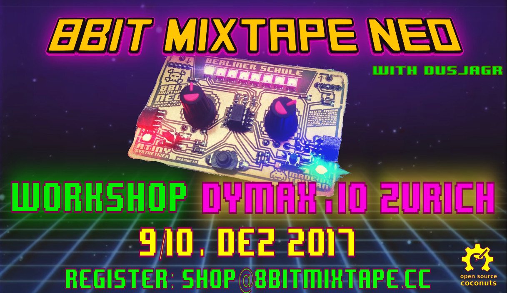

# Coming up soon: The "LAST" Mixtape Workshop in Zurich !!!

# **Register Now, only a few places left!!!!**

# Schedule
## 14 - 19h Saturday 9. Dez

## 14 - 18h Sunday 10. Dez

# Who
## Mentor Marc Dusseiller aka dusjagr

See more on http://me.dusjagr.guru

Marc Dusseiller aka dusjagr is a nomadic researcher and workshopologist. He is part of the [Center for Alternative Coconut Research](http://www.randelab.ch/) and co-founder of [SGMK](http://mechatronicart.ch) and the [Hackteria network](http://hackteria.org). Before travelling the world for making DIY / DIWO laboratories for creative biological experimentation with living media, Marc entered the world of DIY electronics, designing printed circuit boards for synthesizers and organizing workshops and festivals mostly in Zürich. He also loves [coconuts](http://www.slideshare.net/dusjagr/smart-coconuts-for-stupid-cities-transformaking-symposium).

## Participants (max 8)
Pre-registered at VCFe
* grt / gvt
* aitana
* tim
* florian
* Herr Kummer
*

## Host: DYMAX.IO

