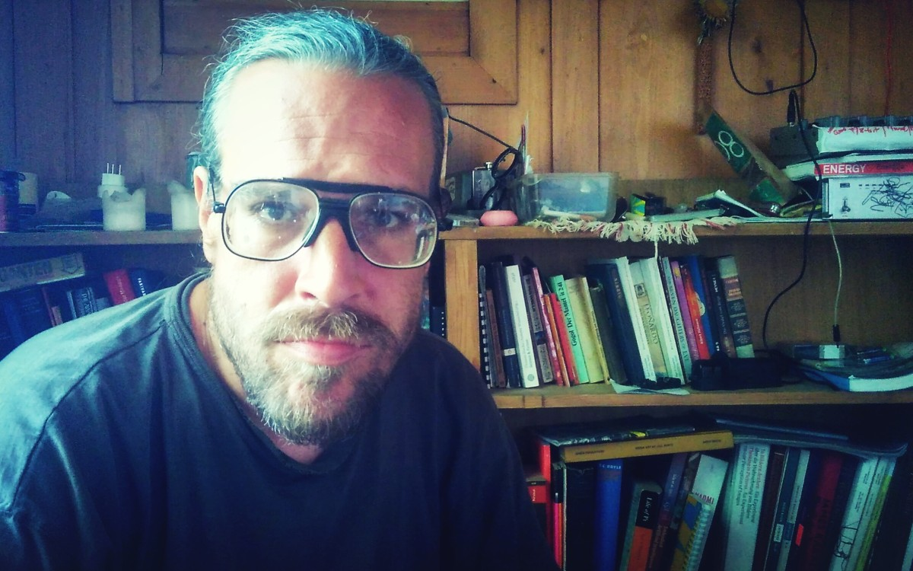

# Workshop Tour - Zagreb - Ljubljana

## Description 

Finally another build and code Workshop-Tour for making the famous 8Bit Mixtape NEO is happening in Zagreb and Ljubljana! Join us for a session of soldering and experimenting with lo-fi 8Bit soundzzz and bluuurrrps.

The 8Bit Mixtape NEO is a lo-fi 8Bit synthesizer based on the Arduino-compatible ATTINY85, featuring 2 Pots, 2 Buttons and 8 addressable RGB Neo-pixels. The key feature of the new 8Bit Mixtape NEO is the easiness of uploading new codes using an audio communication protocol.

The 8Bit Mixtape NEO has been developed since Winter 2017 by dusjagr, ChrisMicro (RoboterClub Freiburg), Budi Prakosa (Lifepatch) and many other contributors! Since December 2018 it's ready for sale on our new website

## 20. Jan @ Radiona, Zagreb
Sunday, 13-18h

Location:

## 22. Jan @ Ljudmila, Ljubljana
Tuesday, 17-23h 

Location:

# 8Bit Mixtape Special Edition 2019

Stay tuned for a special edition dedicated and limited to ONLY this tour mixtapeica!

## Related Info on the 8Bit Mixtape

Check-out what other people wrote about it:
http://wiki.8bitmixtape.cc/#/4_13-Publication

# Mentor: Marc Dusseiller aka dusjagr

See more on http://me.dusjagr.guru

Marc Dusseiller aka dusjagr is a nomadic researcher and workshopologist. He is part of the [Center for Alternative Coconut Research](http://www.randelab.ch/) and co-founder of [SGMK](http://mechatronicart.ch) and the [Hackteria network](http://hackteria.org). Before travelling the world for making DIY / DIWO laboratories for creative biological experimentation with living media, Marc entered the world of DIY electronics, designing printed circuit boards for synthesizers and organizing workshops and festivals mostly in Zürich, Taipei and Yogyakarta. He also loves [coconuts](http://neo.8bitmixtape.cc/).

