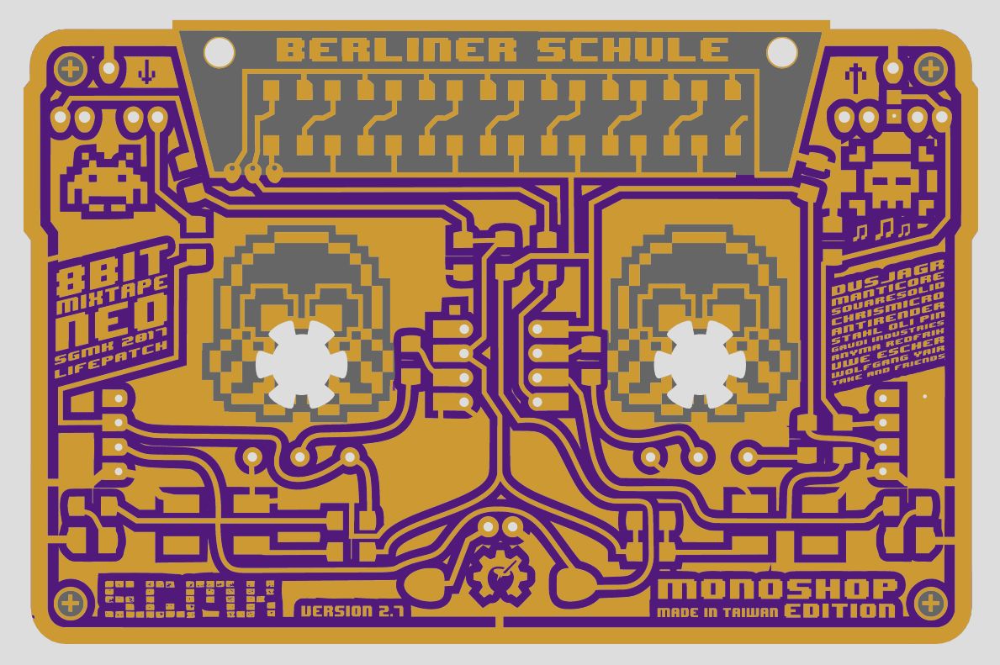
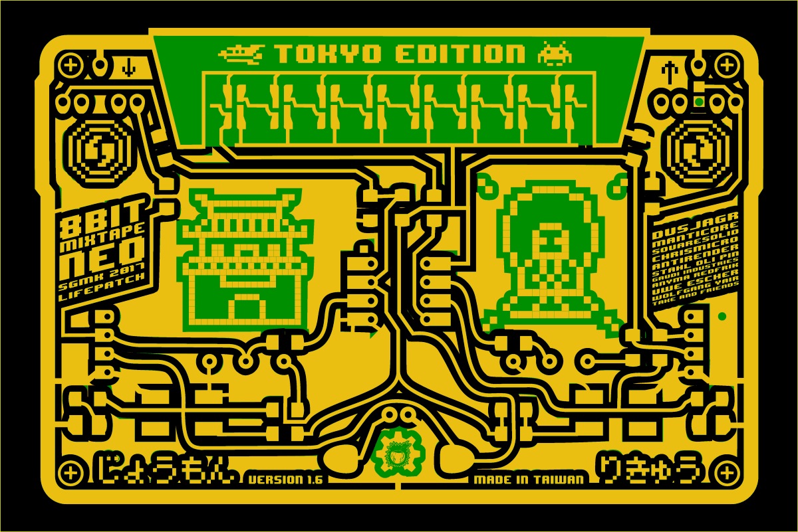
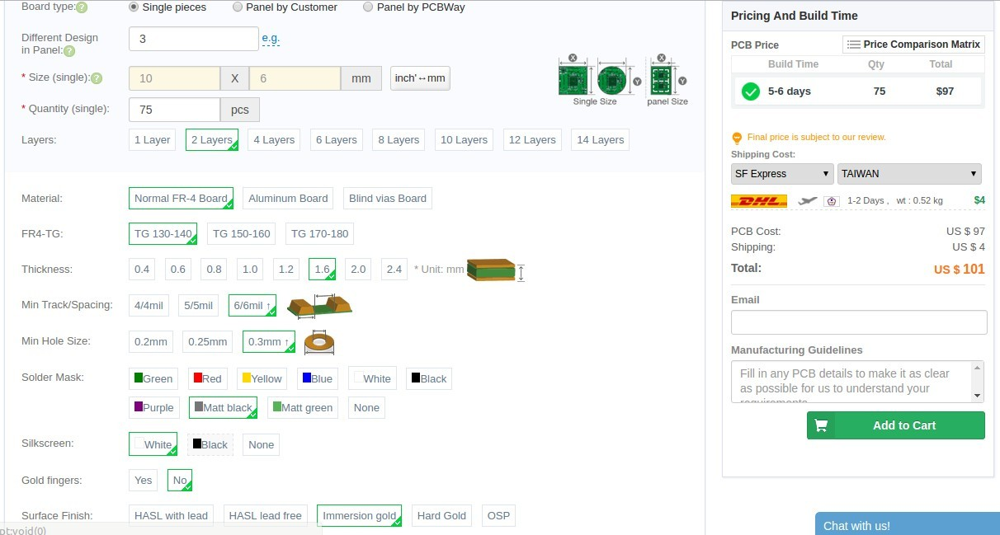
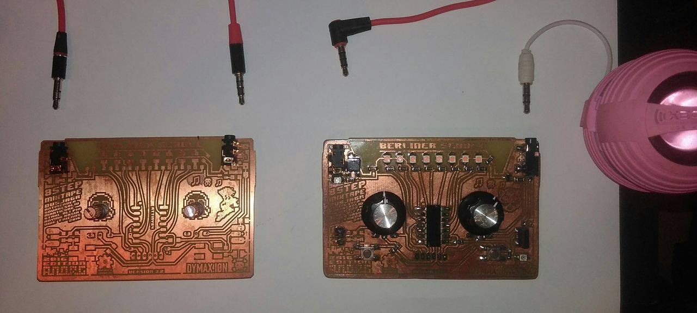
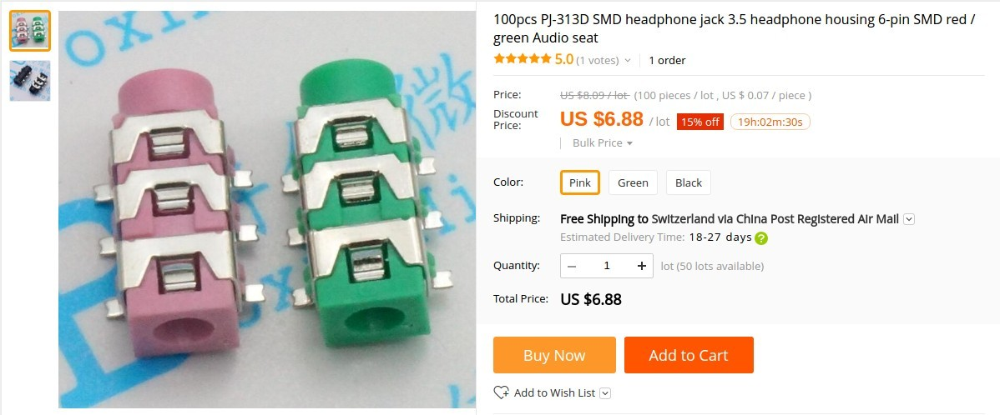

# PCB Design for Manufacturing

## Version 2.5-7 PCBway

https://www.pcbway.com/project/shareproject/8Bit_Mixtape_NEO___BERLINER_SCHULE.html

### Special Edition Lab by Dimension Plus

### Special Edition - Berliner Jewelry

[Download gerber files or order from PCBway](https://www.pcbway.com/project/shareproject/8Bit_Mixtape_NEO___BERLINER_SCHULE.html)

## Version 1.4 Taiwan Edition

### Shenzhen Ready - Double sided boards
Playing around with different combination of copper layer and soldermask... Gold-coated and matte black soldermaks. sometimes a bit of white silkscreen.

**Frontside Show all Copper, Backside Black-covered**

**All Black**

**Naked board - looks like DIY?**

## Tokyo Edition

Pfff... with this process. kinda difficult to change the designs. but the top text easy to replace.

## Comments and ideas

* fix the pads for the 3535 Neo-pixels

## Old Notes and Ideas

Or of course just black on the board, not the cupper.

## The Dark Side of the Board

### Features to add on the backside

### Pads for adding extra stuff

Audio extras:

* volume wheel
* Mosfet \(which one?\) amplification stage for driving speakers
* sot23 or 223 package? \(dusjagr goes for 223\)
* extra Audio Filters - Wolfgang style

Power extras:

* USB micro pads \(only power lines\)
* pads for SMD battery holder CR2032 \(for Ucok\)
* \(LiPo charging circuit...\) maybe next time...

Sync and connectivity

* Extra connections for the Sync-out from Reset pin \(missing so far\)
* Uwe's Sync circuit \(sot223? what part?\)
* CV in 2 for geeks

Other connections:

* solder-pads below for potentiometers
* through hole for the 8pin DIL socket?
* ISP pads. just in case \(standard and mixtape un-standard\)
* side pin-headers also from below solderable

Extra designs and logos

* hmmmm.. so many credits don't fit on the frontside

websites

* 8bitmixtape.github.io
* Roboterclub-Freiburg.de

Some japanese fonts: [http://www.akibatec.net/wabunfont/category/edo.html](http://www.akibatec.net/wabunfont/category/edo.html)

### 

## PCBway order details

# Discussion about easy available parts for manufacturing and DIY

## SMD 1206 or 0805 or both?

## The Audio Plug

For the 8Bit Mixtape we go for a 2 plug system.

To think about:

* SMD or Throug-Hole
* should the plug be on the back or front -&gt; stability of board when on the table.
* colors?

### Overview

### TRS or TRRS, switched or not?

This one can be soldered on the backside or the front!  
but not switched and only TRS.

A claassic! i kinda like it. we could add a little speaker to the board and switch it off. Also do some magic on detecting the sound-prog cable is not plugged and go directly to the code. but not TRRS.

TRRS could be used to send the sync signal and connect all mixtapes together.

https://www.aliexpress.com/store/group/3-5mm-Female-Jack/1708466_500917156/2.html?spm=2114.12010612.0.0.HBjrQf&SortType=bestmatch_sort&g=y

## Power management?

### Power switch

### recharchable

## NEO-pixels

5050 or 3535?

