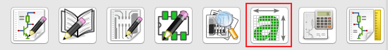
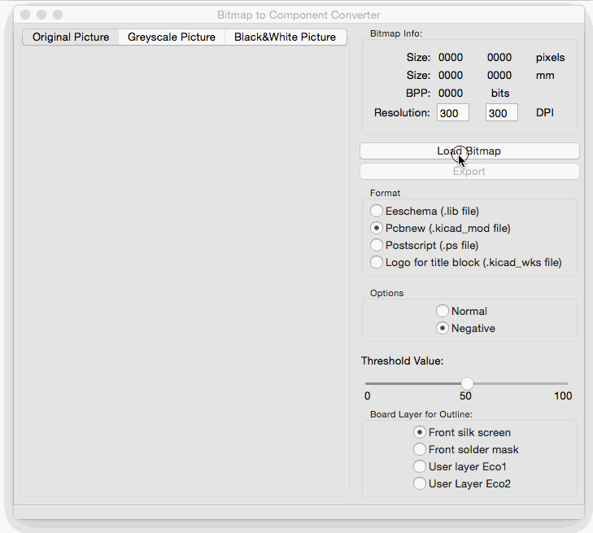

B Art with Kicad and Inkscape

## PCB Art Design Workflow

### What is required \(for 1 layer pcb\)

1. Front Copper Layer \(F.CU\) / Required
2. Front Solder Mask \(F.Mask\) / Optional
3. Front Silkscreen Layer \(F.Silk\) / Optional
4. Each \(1-3\) Exported in 600 DPI White Background
5. Board Edge Outline Cut \(this will be used for cutting the pcb shape\) - need DXF Format / Required
6. Drill Hole layer / Optional \(if smd part only\)

### Simplified Workflow

1. Design PCB in Inkscape \(Copper, Mask, Silkscreen, Outline\)
2. Import Design to Kicad
3. Define Drill Hole in Kicad
4. Generate Gerber
5. Submit to manufacturer eg Oshpark, PCBWay

### Complete Workflow

todo

### How to Import design from Inkscape to Kicad

* Open Bitmap2Component from Kicad   
  

* Convert Exported Layer from Inkscape to Kicad Footprint With Format: PCBNew, Options: Negative
  

## Gerber Layer / Kicad PCB layer visual explanation

### Reference

* [http://wiki.sgmk-ssam.ch/wiki/Shenzhen\_Ready](http://wiki.sgmk-ssam.ch/wiki/Shenzhen_Ready)
* [https://medium.com/@urish/a-practical-guide-to-designing-pcb-art-b5aa22926a5c](/h ttps://medium.com/@urish/a-practical-guide-to-designing-pcb-art-b5aa22926a5c)
* [http://escalalibre.com/edwt/kicad\_sizeConverter.php](http://escalalibre.com/edwt/kicad_sizeConverter.php)

