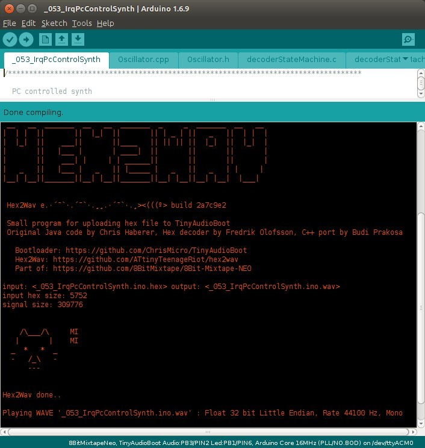
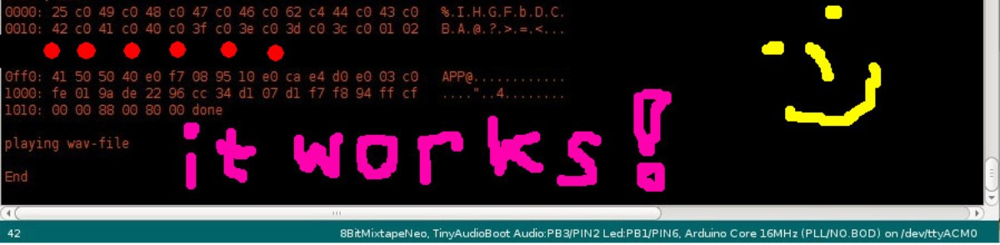

# Changelog

Package source https://github.com/8BitMixtape/8BitMixtapePlatform

* ### Package Version 0.0.20
  * [[Hex2Wav]](4_4.1-Hex2Wav.md) add bash script to detect 64/32 linux, added multi arch binary [git-log](https://github.com/8BitMixtape/8BitMixtapePlatform/commit/67b5af00e365b92ddb570b836770fde5092b3e24)

* ### Package Version 0.0.19
  * [Hex2Wav](4_4.1-Hex2Wav.md): FIXED Linux 64 Bit issue, broken on 32bit

* ### Package Version 0.0.16 - 0.0.18
  * This version contains [Hex2Wav](4_4.1-Hex2Wav.md): ERROR Linux 64/32 Bit issue

* ### Package Version 0.0.15
  * Added [Neo Examples](https://github.com/8BitMixtape/NeoCodeExamples) 
  * Added [Adafruit Neopixel Library](https://github.com/adafruit/Adafruit_NeoPixel)

* ### Package Version 0.0.14
  * Added [WS2812\_light](https://github.com/cpldcpu/light_ws2812) library 

* ### Package Version 0.0.13

  * Added eeprom support to bootloader and hex2wavjs [web interface](https://attinyteenageriot.github.io/hex2wavjs/eeprom.html) test 
  * Refactored [Hex2WavJS](https://github.com/AttinyTeenageRiot/hex2wavjs) code and become a library
  * Added neo lib to package
  * Notes: 
    * Bootloader size increased a bit
    * Todo: remove blink fast on error to decrease bootloader size

* ### Package Version 0.0.8

This is based on the new port of [hex2wav to c++](4_4-Hex2Wav)

You can click on Sketch -&gt; Export compiled Library

This will save the .wav file in your sketch-folder.

#### Got it working !!! Thx Iyok!

