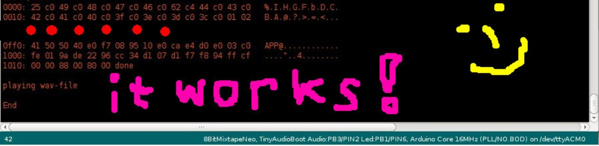

# Changelog

### Package version 0.0.13

* Added eeprom support to bootloader and hex2wavjs [web interface](https://attinyteenageriot.github.io/hex2wavjs/eeprom.html) test 
* Added neo lib to package

### Package version 0.0.8

This is based on the new port of [hex2wav to c++](https://github.com/8BitMixtape/8Bit-Mixtape-NEO/wiki/3_4-Hex2Wav)

You can click on Sketch -> Export compiled Library

This will save the .wav file in your sketch-folder.

#### Got it working !!! Thx Iyok!

