# We are selling!!!

## Order your mixtape here [http://shop.8bitmixtape.cc/product/8bitmixtapeneokit/](http://shop.8bitmixtape.cc/product/8bitmixtapeneokit/)

## Check Local distributor here [http://neo.8bitmixtape.cc/shop/distributor](http://neo.8bitmixtape.cc/shop/distributor)

**Free Shipping Worldwide!!!**

# Series I - DIY Kits for 8Bit Mixtape NEO

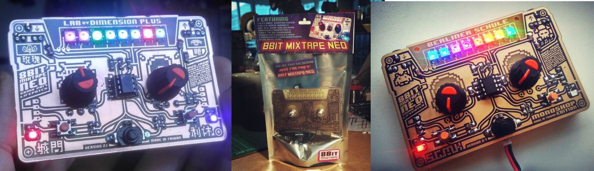  
Batch 001/002 - Lab by Dimension Plus \| Taiwan Special Edition  
Batch 003 - Berliner Schule \| Monoshop Special Edition

# Series I - DIY Kits for 8Bit Mixtape NEO

## "Just for Pro's" SMD Kit \([65 €](https://www.paypal.me/8bitmixtape/65eur) ~~instead of 75€~~\)

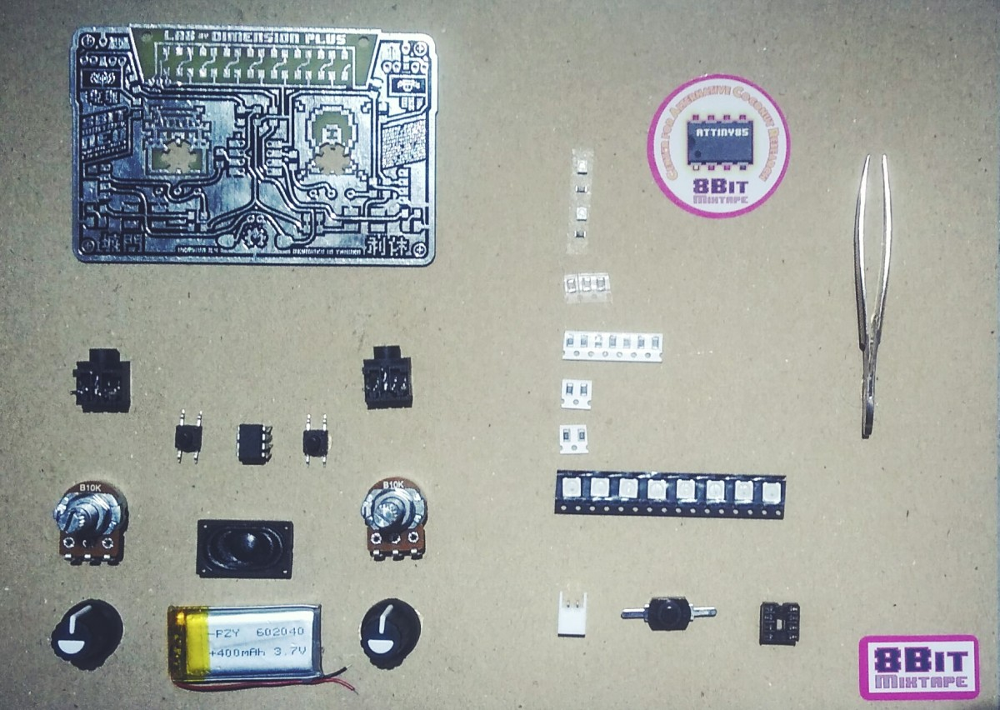

## "Easy Kit" SMD-preassembled \([85 €](https://www.paypal.me/8bitmixtape/85eur) ~~instead of 95€~~\)

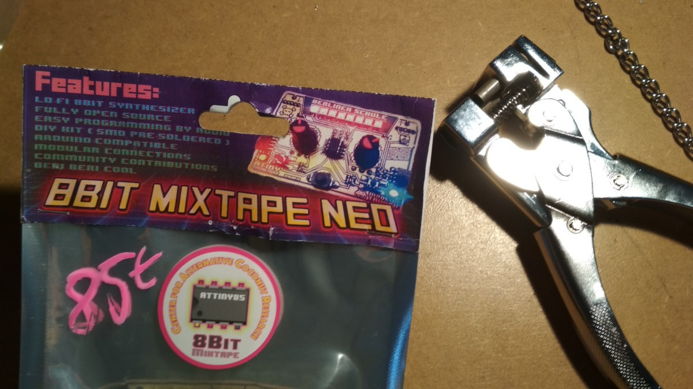

## "Deluxe Add-Ons" \([on demand](https://www.paypal.me/8bitmixtape/)\)

* Gold Chain
* 3d-printed case
* Internal Speaker
* LiPo battery and charging unit
* bling bling

## on demand - Hipster versions \([contact shop](mailto:shop@8bitmixtape.cc)\)

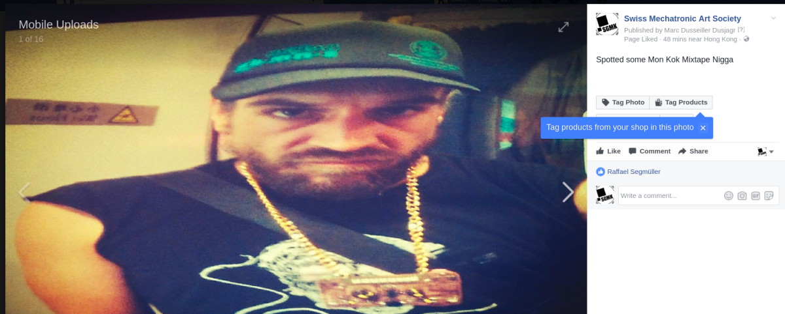

# Series II - coming soon... \(est Jan 2018\)

* Minor improvements for battery positioning
* new design elements
* factory pre-assembled version of "Easy Kit"

# Special Vintage Series - 8Bit Mixtape 1.0 RETRO \(limited\)

A re-birth of the classic 2014 Manila Edition, now compatible to AudioProg and NEO!!

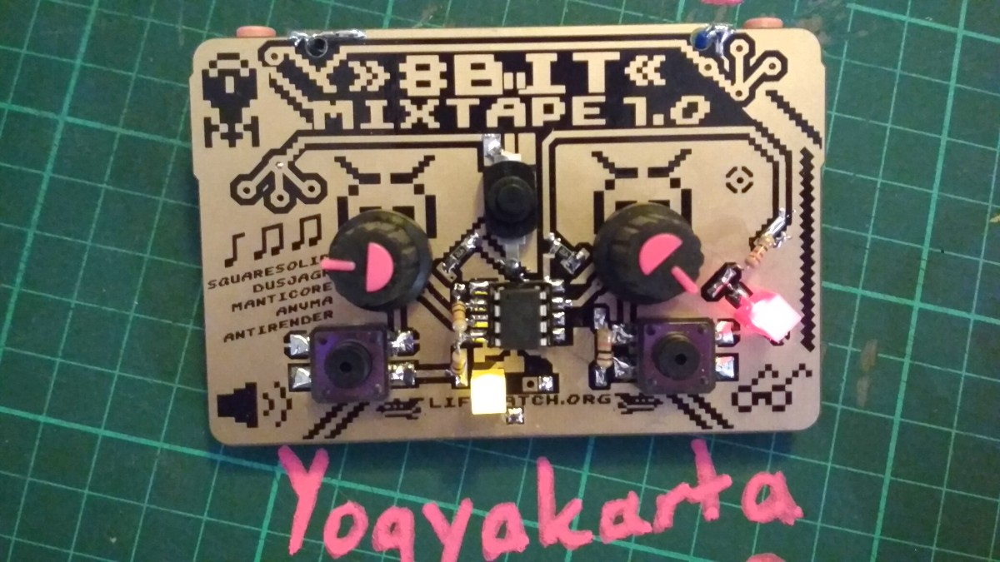

# Where to buy it

## In Your Local Shop

### Berlin

#### Central Music - Since 1986

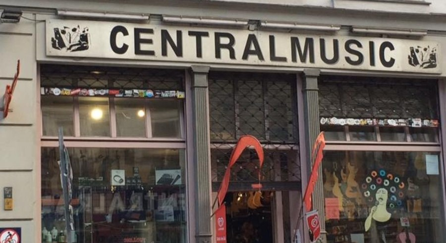  
[http://centralmusicberlin.blogspot.de/](http://centralmusicberlin.blogspot.de/)  
to be delivered soon...

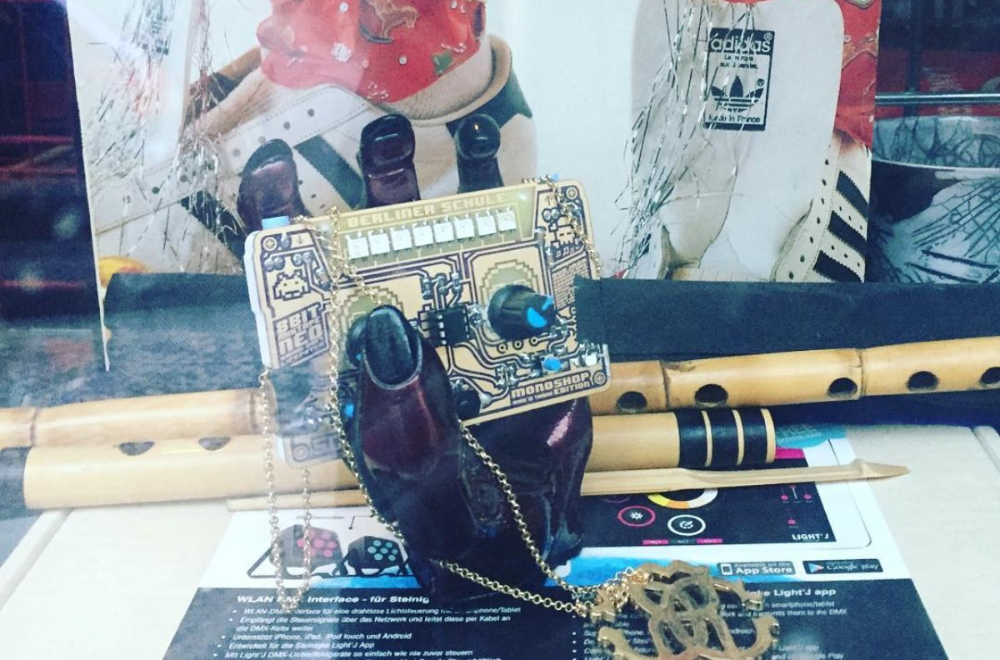

#### Common Ground - Since 2017

[https://commonground.community/](https://commonground.community/)

### Hong Kong

#### Lab by DimensionPlus HK

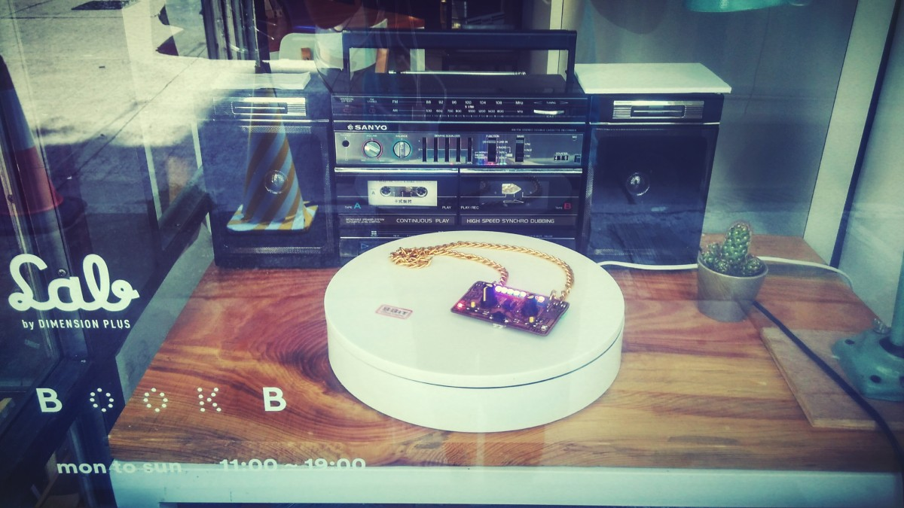  
[http://labbydimensionplus.co/hk/](http://labbydimensionplus.co/hk/)

### München

#### Erfindergarden

[https://erfindergarden.de/](https://erfindergarden.de/)

### Shenzhen

### Taipei

#### Lab by DimensionPlus TW

[https://www.facebook.com/labdptw/](https://www.facebook.com/labdptw/)

### Tel Aviv

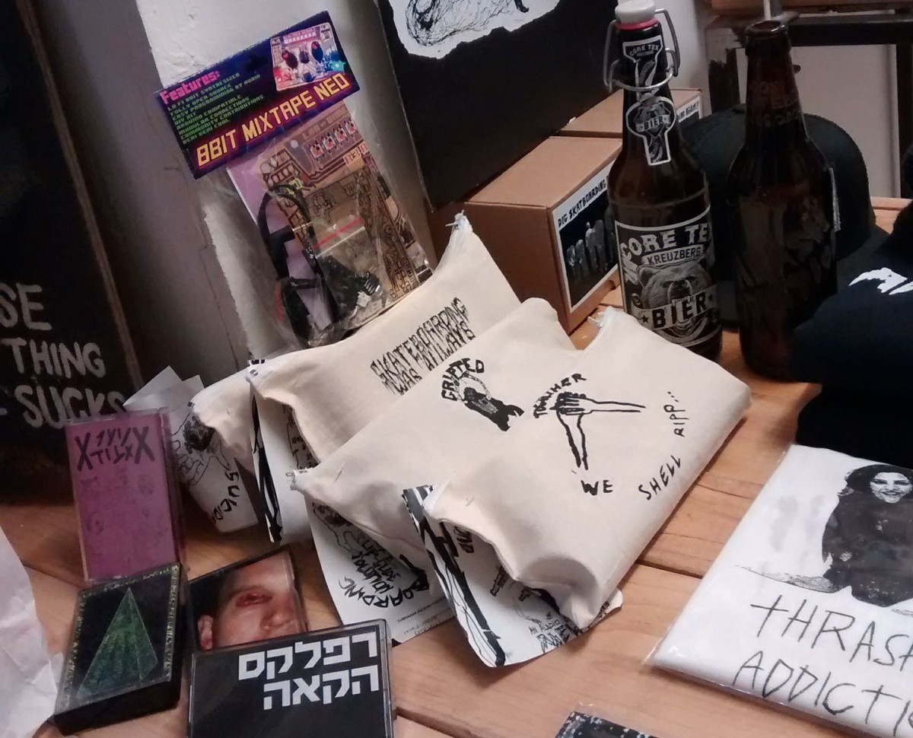

### Yogyakarta

### Zürich

#### UP BEAT - Musikhaus

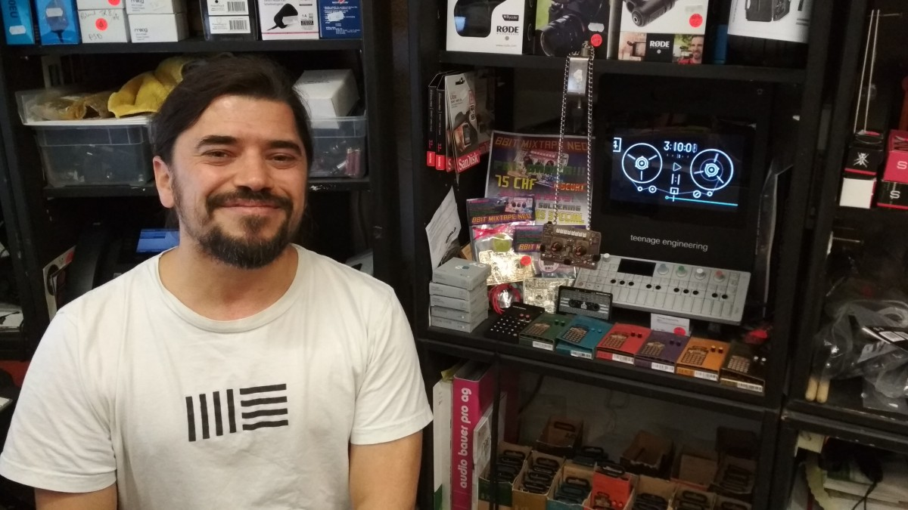  
[http://www.upbeat.ch](http://www.upbeat.ch)

#### Dymax.iøn

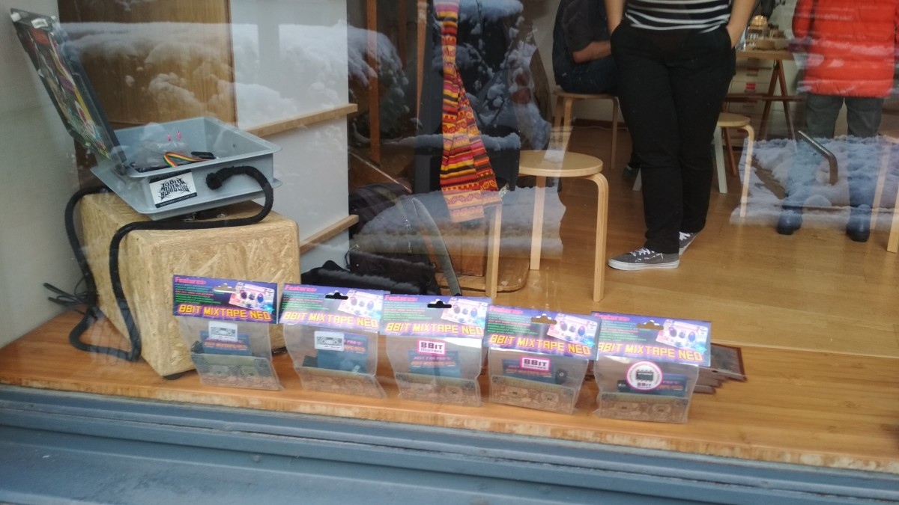
[https://www.dymax.io/](https://www.dymax.io/)

#### loops&bits

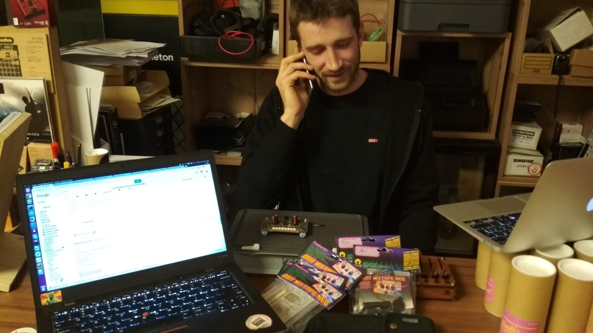

[https://www.loopsandbits.ch/](https://www.loopsandbits.ch/)

## Online Re-sellers

get in contact with us! [mailto:shop@8bitmixtape.cc](mailto:shop@8bitmixtape.cc)

