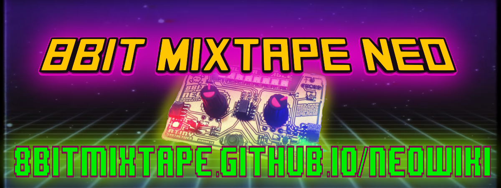

<!-- _coverpage.md -->

# 8BitMixtape-NEO <small>HW v0.96 SW v0.20</small>

> A very very cool open source synthesizer.

- Reprogram with audio
- Low Cost
- 8 Neo Pixels LED

[Get Started](Home)
[View Source](https://github.com/8BitMixtape/8Bit-Mixtape-NEO)
[Buy Mixtape](https://www.paypal.com/ch/cgi-bin/webscr?cmd=_flow&SESSION=kOXdxGdqaFeJB73P3HIUKbzukGmCKCGCpmzJ3puWQ4-tJsF1HAqPGgduHbi&dispatch=5885d80a13c0db1f8e263663d3faee8d83a0bf7db316a7beb1b14b43acd04037&rapidsState=Donation__DonationFlow___StateDonationLogin&rapidsStateSignature=627c35860a5e9d792eb914ec196b018128a1388c)

The 8Bit Mixtape is a lo-fi 8Bit synthesizer based on the Arduino-compatible ATTINY85, featuring 2 Pots, 2 Buttons and 8 adressable RGB Neo-pixels. The key feature of the new 8Bit Mixtape is the easiness of uploading new codes using an audio communication protocol, means just playing a .wav sound file from your computer/smart phone (or walkman). A specific bootloader (TinyAudioBoot) has to be installed on the chip to be able to do so.
